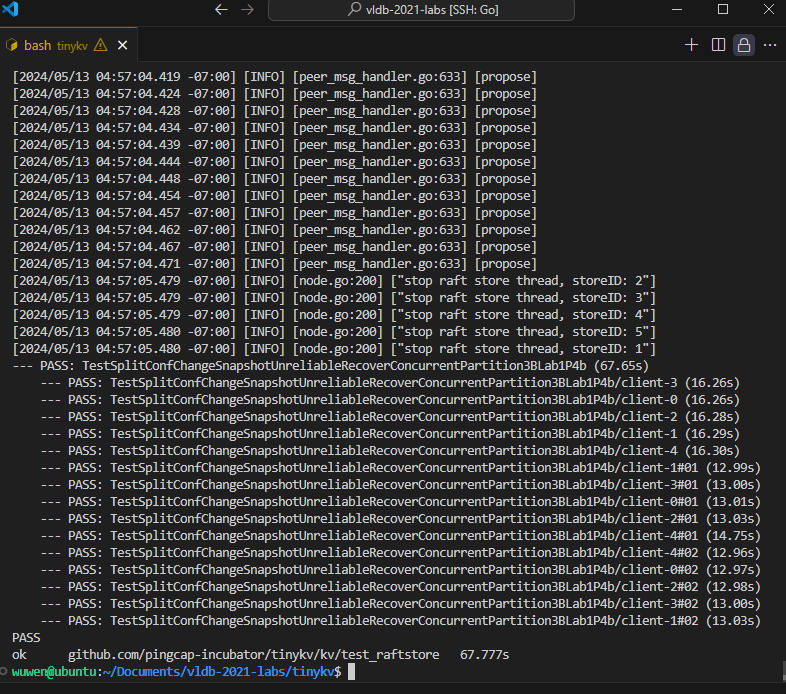
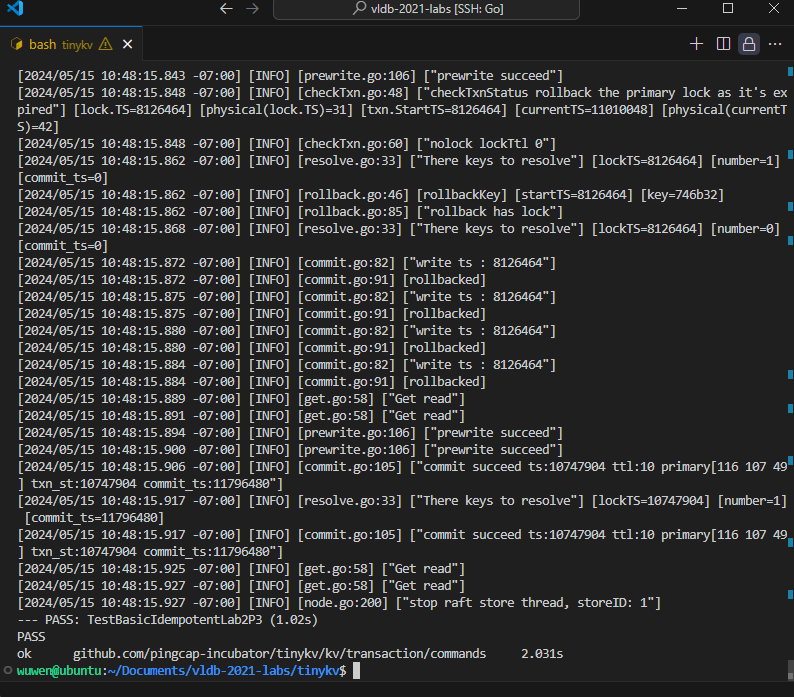

## lab1

### Part 1 Implement The Core Interfaces of `StandAloneStorage`

这一部分是为了熟悉一些重要的数据结构、接口等。这一部分实现了一个单机的存储引擎的接口，一共需要实现两个接口函数

```go
func (s *StandAloneStorage) Reader(ctx *kvrpcpb.Context) (storage.StorageReader, error) {
    // YOUR CODE HERE (lab1).
	return NewBadgerReader(s.db.NewTransaction(false)),nil
	panic("not implemented yet")
	return nil, nil
}

func (s *StandAloneStorage) Write(ctx *kvrpcpb.Context, batch []storage.Modify) error {
    // YOUR CODE HERE (lab1).
	// Try to check the definition of `storage.Modify` and txn interface of `badger`.
	// As the column family is not supported by `badger`, a wrapper is used to simulate it.
	txn:=s.db.NewTransaction(true)
	defer txn.Commit()
	for _,m := range(batch) {
        switch m.Data.(type) {
            case storage.Put:
			put := m.Data.(storage.Put)
			err := txn.Set(engine_util.KeyWithCF(put.Cf,put.Key),put.Value)
			if err != nil {
                return err
			}
		case storage.Delete:
			delete := m.Data.(storage.Delete)
			err := txn.Delete(engine_util.KeyWithCF(delete.Cf,delete.Key))
			if err != nil{
                return err
			}
		}
	}
	return nil
	panic("not implemented yet")
	return nil
}
```

相应的测试为 `make lab1P0`，测试的结果如下


### Part 2 Implement The Core Interfaces of `RaftStorage`

这一部分主要实现了raftstorage以进行log,涉及到了一个message进入，分派，共识，落盘的全过程

这一部分调试的过程还是比较痛苦的，有很多的注释，但是有些也比较的模糊，几行代码磨了好久，特别是HardState那边的操作逻辑。

这一部分的实现，特别是append函数的实现，体现出了分布式算法中“向leader看齐”这一概念。

`proposeRaftCommand`中，相关的注释较为的完善，像cb.Done的用法也是在后面的代码里面出现过。peer这个结构体定义里面也有比较完善的描述。这一个函数负责处理raftcommand这一个msg类型

`HandleRaftReady`这一个函数用来处理由raft处理完成的ready数据。这些数据暂时被存在内存的一个log中，当调用这个函数的时候，会将这些ready根据情况进行持久化或者发给别的节点。我们需要填写的代码比较简单。首先判断下层raft是否有需要处理的raft，然后持久化和发给别的节点的代码逻辑已经完成了，最后我们需要根据处理完成之后的ready状态调用advance是的整个raftgroup对应的状态机向前。

`SaveReadyState`用于持久化上面提到的ready，包括处理快照、entry和状态。整体来说就是向kvWB和raftWB加入相应的数据，然后通过 `MustWriteToDB`方法按批写入相应的存储引擎。快照已经处理好了；entry一部分实在append这个函数里面处理的，之后提到；HardState的这个处理搞了很久，不仅需要持久化，也要跟新当前peerstore的状态，否则在重启服务器的时候会出现问题。

`Append`这个函数将所有的entry放到raftWB中，然后更新相应的index和term，并且删除和leader不一致的。这一部分就是上文提到的向leader看齐。然后在这一部分的注释中写了如何使用kvWB和raftWB进行写入。

代码如下：

```go
//`kv/raftstore/peer_msg_handler.go`
func (d *peerMsgHandler) proposeRaftCommand(msg *raft_cmdpb.RaftCmdRequest, cb *message.Callback) {
	err:=d.preProposeRaftCommand(msg)
	if err != nil {
		cb.Done(ErrResp(err))
		return
	}
	if d.stopped {
		notifyRegionRemoved(d.regionId,d.PeerId(),pendingCmd{term: d.Term(),index: d.nextProposalIndex(),cb:cb})
		return
	}
	resp:=newCmdResp()
	BindRespTerm(resp,d.Term())
	d.Propose(d.ctx.engine.Kv,d.ctx.cfg,cb,msg,resp)
	return
	panic("not implemented yet")
	// YOUR CODE HERE (lab1).
	// Hint1: do `preProposeRaftCommand` check for the command, if the check fails, need to execute the
	// callback function and return the error results. `ErrResp` is useful to generate error response.

	// Hint2: Check if peer is stopped already, if so notify the callback that the region is removed, check
	// the `destroy` function for related utilities. `NotifyReqRegionRemoved` is useful to generate error response.

	// Hint3: Bind the possible response with term then do the real requests propose using the `Propose` function.
	// Note:
	// The peer that is being checked is a leader. It might step down to be a follower later. It
	// doesn't matter whether the peer is a leader or not. If it's not a leader, the proposing
	// command log entry can't be committed. There are some useful information in the `ctx` of the `peerMsgHandler`.
}
```

```go
//`kv/raftstore/peer.go`
func (p *peer) HandleRaftReady(msgs []message.Msg, pdScheduler chan<- worker.Task, trans Transport) (*ApplySnapResult, []message.Msg) {
	if p.stopped {
		return nil, msgs
	}

	if p.HasPendingSnapshot() && !p.ReadyToHandlePendingSnap() {
		log.Debug(fmt.Sprintf("%v [apply_id: %v, last_applying_idx: %v] is not ready to apply snapshot.", p.Tag, p.peerStorage.AppliedIndex(), p.LastApplyingIdx))
		return nil, msgs
	}

	// YOUR CODE HERE (lab1). There are some missing code pars marked with `Hint` above, try to finish them.
	// Hint1: check if there's ready to be processed, if no return directly.
	// panic("not implemented yet")
	if !p.RaftGroup.HasReady() {
		return nil,msgs
	}

	// Start to handle the raft ready.
	log.Debug(fmt.Sprintf("%v handle raft ready", p.Tag))

	ready := p.RaftGroup.Ready()
	// TODO: workaround for:
	//   in kvproto/eraftpb, we use *SnapshotMetadata
	//   but in etcd, they use SnapshotMetadata
	if ready.Snapshot.GetMetadata() == nil {
		ready.Snapshot.Metadata = &eraftpb.SnapshotMetadata{}
	}

	// The leader can write to disk and replicate to the followers concurrently
	// For more details, check raft thesis 10.2.1.
	if p.IsLeader() {
		p.Send(trans, ready.Messages)
		ready.Messages = ready.Messages[:0]
	}
	ss := ready.SoftState
	if ss != nil && ss.RaftState == raft.StateLeader {
		p.HeartbeatScheduler(pdScheduler)
	}

	applySnapResult, err := p.peerStorage.SaveReadyState(&ready)
	if err != nil {
		panic(fmt.Sprintf("failed to handle raft ready, error: %v", err))
	}
	if !p.IsLeader() {
		p.Send(trans, ready.Messages)
	}

	if applySnapResult != nil {
		/// Register self to applyMsgs so that the peer is then usable.
		msgs = append(msgs, message.NewPeerMsg(message.MsgTypeApplyRefresh, p.regionId, &MsgApplyRefresh{
			id:     p.PeerId(),
			term:   p.Term(),
			region: p.Region(),
		}))

		// Snapshot's metadata has been applied.
		p.LastApplyingIdx = p.peerStorage.truncatedIndex()
	} else {
		committedEntries := ready.CommittedEntries
		ready.CommittedEntries = nil
		l := len(committedEntries)
		if l > 0 {
			p.LastApplyingIdx = committedEntries[l-1].Index
			msgs = append(msgs, message.Msg{Type: message.MsgTypeApplyCommitted, Data: &MsgApplyCommitted{
				regionId: p.regionId,
				term:     p.Term(),
				entries:  committedEntries,
			}, RegionID: p.regionId})
		}
	}

	// YOUR CODE HERE (lab1). There are some missing code pars marked with `Hint` above, try to finish them.
	// Hint2: Try to advance the states in the raft group of this peer after processing the raft ready.
	//        Check about the `Advance` method in for the raft group.
	// panic("not implemented yet")
	p.RaftGroup.Advance(ready)
	return applySnapResult, msgs
}
```

```go
//`kv/raftstore/peer_storage.go`
func (ps *PeerStorage) Append(entries []eraftpb.Entry, raftWB *engine_util.WriteBatch) error {
	log.Debug(fmt.Sprintf("%s append %d entries", ps.Tag, len(entries)))
	prevLastIndex := ps.raftState.LastIndex
	if len(entries) == 0 {
		return nil
	}
	lastEntry := entries[len(entries)-1]
	lastIndex := lastEntry.Index
	lastTerm := lastEntry.Term
	// panic("not implemented yet")
	// YOUR CODE HERE (lab1).
	for _, entry := range entries {
		// Hint1: in the raft write batch, the log key could be generated by `meta.RaftLogKey`.
		//       Also the `LastIndex` and `LastTerm` raft states should be updated after the `Append`.
		//       Use the input `raftWB` to save the append results, do check if the input `entries` are empty.
		//       Note the raft logs are stored as the `meta` type key-value pairs, so the `RaftLogKey` and `SetMeta`
		//       functions could be useful.
		log.Debug(fmt.Sprintf("entry=%v", entry))
		lastIndex = entry.Index
		lastTerm = entry.Term
		raftWB.SetMeta(meta.RaftLogKey(ps.region.GetId(),lastIndex),&entry)
	}
	// log.Info(fmt.Sprintf("lastindex %d lastTerm %d prevIndex %d prevTerm %d",lastIndex,lastTerm,prevLastIndex,lastTerm))
	for i := lastIndex + 1; i <= prevLastIndex; i++ {
		// Hint2: As the to be append logs may conflict with the old ones, try to delete the left
		//       old ones whose entry indexes are greater than the last to be append entry.
		//       Delete these previously appended log entries which will never be committed.
		raftWB.DeleteMeta(meta.RaftLogKey(ps.region.GetId(),i))
	}

	ps.raftState.LastIndex = lastIndex
	ps.raftState.LastTerm = lastTerm
	return nil
}
```

```go
//`kv/raftstore/peer_storage.go`
func (ps *PeerStorage) SaveReadyState(ready *raft.Ready) (*ApplySnapResult, error) {
	kvWB, raftWB := new(engine_util.WriteBatch), new(engine_util.WriteBatch)
	prevRaftState := ps.raftState
	var applyRes *ApplySnapResult = nil
	var err error
	if !raft.IsEmptySnap(&ready.Snapshot) {
		applyRes, err = ps.ApplySnapshot(&ready.Snapshot, kvWB, raftWB)
		if err != nil {
			return nil, err
		}
	}
	// panic("not implemented yet")
	// YOUR CODE HERE (lab1).
	// Hint: the outputs of the raft ready are: snapshot, entries, states, try to process
	//       them correctly. Note the snapshot apply may need the kv engine while others will
	//       always use the raft engine.
	if len(ready.Entries) != 0 {
		// Hint1: Process entries if it's not empty.
		err:=ps.Append(ready.Entries,raftWB)
		if err != nil {
			return nil,err
		}
	}

	// Last index is 0 means the peer is created from raft message
	// and has not applied snapshot yet, so skip persistent hard state.
	if ps.raftState.LastIndex > 0 {
		// Hint2: Handle the hard state if it is NOT empty.
		if !raft.IsEmptyHardState(ready.HardState) {
			*ps.raftState.HardState = ready.HardState
			raftWB.SetMeta(meta.RaftStateKey(ps.region.GetId()),&ps.raftState)
		}
	}

	if !proto.Equal(&prevRaftState, &ps.raftState) {
		raftWB.SetMeta(meta.RaftStateKey(ps.region.GetId()), &ps.raftState)
	}

	kvWB.MustWriteToDB(ps.Engines.Kv)
	raftWB.MustWriteToDB(ps.Engines.Raft)
	return applyRes, nil
}
```

### 测试结果

由于测试时候会打印很多东西出来，所以只截取部分
lab1p1a

lab1p1b

lab1p2a


lab1p2b


lab1p3a


lab1p3b


lab1p4a


lab1p4b



## lab2

### Part1 Implement the `Get` Command

这一部分实现了从数据库中读取一个数据。根据percolator的要求，事务读取一个数据的时候，首先需要检查一下这个key上面有没有锁。如果有锁，再看这把锁上锁的时间是不是在本事务开始之前，如果是，则直接返回，因为这代表着有一个写事务没有提交。如果没有就使用getvalue方法获取值。如果没有相应的值，要修改response的相关字段。
主要需要阅读的相关代码在txn和lock类中
代码如下：

```go
func (g *Get) Read(txn *mvcc.RoTxn) (interface{}, [][]byte, error) {
	key := g.request.Key
	log.Debug("read key", zap.Uint64("start_ts", txn.StartTS),
		zap.String("key", hex.EncodeToString(key)))
	response := new(kvrpcpb.GetResponse)

	// panic("kv get is not implemented yet")
	// YOUR CODE HERE (lab2).
	// Check for locks and their visibilities.
	// Hint: Check the interfaces provided by `mvcc.RoTxn`.
	lock,err:=txn.GetLock(key)
	if err != nil {
		return response,nil,err
	}
	if lock.IsLockedFor(key,txn.StartTS,response) {

		return response,nil,nil
	}

	// YOUR CODE HERE (lab2).
	// Search writes for a committed value, set results in the response.
	// Hint: Check the interfaces provided by `mvcc.RoTxn`.
	value,err:=txn.GetValue(key)
	if err != nil {
		return nil,nil,err
	}
	response.Value=value
	if value == nil {
		response.NotFound = true
	}
	log.Info("Get read")
	return response, nil, nil
}
```

### Implement the `Prewrite`and `Commit` Commands

这一部分实现了percolator中的两阶段提交的部分，分别是 `Prewrite`和 `Commit`。
`Prewrite`中，首先检查是否存在提交时间在本事务开始时间前或相等的commit操作，如果有则返回错误。其次检查需要进行写的key是否被上锁，如果有锁则报错，因为这代表着已经有了另外的一个prewrite操作了。之后加锁，并修改。这里要注意对于一个事务重复发送请求的情况，这种情况也是合理的，不用报错。

PutLock方法的参数找起来有点麻烦

代码如下：

```go
func (p *Prewrite) prewriteMutation(txn *mvcc.MvccTxn, mut *kvrpcpb.Mutation) (*kvrpcpb.KeyError, error) {
	key := mut.Key
	log.Debug("prewrite key", zap.Uint64("start_ts", txn.StartTS),
		zap.String("key", hex.EncodeToString(key)))
	// YOUR CODE HERE (lab2).
	// Check for write conflicts.
	// Hint: Check the interafaces provided by `mvcc.MvccTxn`. The error type `kvrpcpb.WriteConflict` is used
	//		 denote to write conflict error, try to set error information properly in the `kvrpcpb.KeyError`
	//		 response.
	// panic("prewriteMutation is not implemented yet")
	write,commit_ts,err:=txn.MostRecentWrite(key)
	if err != nil {
		return nil, err
	}
	if write != nil && commit_ts>=txn.StartTS {
		err := &kvrpcpb.KeyError{Conflict: &kvrpcpb.WriteConflict{StartTs: txn.StartTS,ConflictTs: commit_ts,Key:key,Primary: p.request.PrimaryLock}}
		log.Info("prewrite fail")
		return err,nil
	}
	// YOUR CODE HERE (lab2).
	// Check if key is locked. Report key is locked error if lock does exist, note the key could be locked
	// by this transaction already and the current prewrite request is stale.
	// panic("check lock in prewrite is not implemented yet")
	lock,err:=txn.GetLock(key)
	if err!=nil {
		return nil,err
	}
	if lock != nil {
		if lock.Ts == txn.StartTS {
			log.Info("duplicate prewrite")
			return nil,nil
		}
		err := &kvrpcpb.KeyError{Locked: lock.Info(key)}
		return err,nil
	}
	// YOUR CODE HERE (lab2).
	// Write a lock and value.
	// Hint: Check the interfaces provided by `mvccTxn.Txn`.
	// panic("lock record generation is not implemented yet")
	txn.PutLock(key,&mvcc.Lock{Primary: p.request.PrimaryLock,Ts: txn.StartTS,Ttl: p.request.LockTtl,Kind: mvcc.WriteKindFromProto(mut.Op)})
	txn.PutValue(mut.Key,mut.Value)
	log.Info("prewrite succeed")
	return nil, nil
}
```

在完成了 `Prewrite`操作后，进行 `Commit`操作。

在 `PrepareWrites`函数中，首先保证提交时间在事务开始时间后。
代码如下：

```go
func (c *Commit) PrepareWrites(txn *mvcc.MvccTxn) (interface{}, error) {
	commitTs := c.request.CommitVersion
	// YOUR CODE HERE (lab2).
	// Check if the commitTs is invalid, the commitTs must be greater than the transaction startTs. If not
	// report unexpected error.
	// panic("PrepareWrites is not implemented for commit command")
	response := new(kvrpcpb.CommitResponse)
	if commitTs<=txn.StartTS {
		return  response,errors.New("unexpected error")
	}

	// Commit each key.
	for _, k := range c.request.Keys {
		resp, e := commitKey(k, commitTs, txn, response)
		if resp != nil || e != nil {
			return response, e
		}
	}

	return response, nil
}
```

之后对每一个key，进行实际的提交，实现在 `commitKey`中。
我们需要做的工作是对未上锁的情况或者锁不是自己事务的情况进行处理。因为有可能一个事务超时被回滚了，则会产生未上锁的情况；如果又被回滚，又被另外一个事务prewrite，那么就产生了被别人获取锁的情况。同时，由于对于同一个事物的重复提交的发送，对于第二个开始的请求是没有锁的，那么就要通过currentwrite方法返回的结果来判断是否已经成功提交这个事务了。在这里需要我们实现的部分是检查重复提交和回滚的部分
代码如下：

```go
func commitKey(key []byte, commitTs uint64, txn *mvcc.MvccTxn, response interface{}) (interface{}, error) {
	lock, err := txn.GetLock(key)
	if err != nil {
		return nil, err
	}

	// If there is no correspond lock for this transaction.
	// panic("commitKey is not implemented yet")
	log.Debug("commitKey", zap.Uint64("startTS", txn.StartTS),
		zap.Uint64("commitTs", commitTs),
		zap.String("key", hex.EncodeToString(key)))
	if lock == nil || lock.Ts != txn.StartTS {
		// YOUR CODE HERE (lab2).
		// Key is locked by a different transaction, or there is no lock on the key. It's needed to
		// check the commit/rollback record for this key, if nothing is found report lock not found
		// error. Also the commit request could be stale that it's already committed or rolled back.

		// log.Info("here")
		// if lock !=nil {
		// 	log.Info(fmt.Sprintf("lock.kind %d",lock.Kind))
		// }
		// if lock != nil && (lock.Kind == mvcc.WriteKindPut || lock.Kind==mvcc.WriteKindRollback) {
		// 	log.Info(fmt.Sprintf("lock.kind %d",lock.Kind))
		// 	respValue := reflect.ValueOf(response)
		// 	keyError := &kvrpcpb.KeyError{Retryable: fmt.Sprintf("request is stale %v", key)}
		// 	reflect.Indirect(respValue).FieldByName("Error").Set(reflect.ValueOf(keyError))
		// 	return response,nil
		// }
		if lock == nil {

			write,ts,err := txn.CurrentWrite(key)
			log.Info(fmt.Sprintf("write ts : %d",ts))
			if err != nil {
				return nil,err
			}
			if write != nil && write.StartTS == txn.StartTS && (write.Kind == mvcc.WriteKindPut || write.Kind == mvcc.WriteKindDelete){
				log.Info("has written before")
				return nil,nil
			}
			if write != nil && write.Kind == mvcc.WriteKindRollback {
				log.Info("rollbacked")
				// return nil,nil
			}
			respValue := reflect.ValueOf(response)
			keyError := &kvrpcpb.KeyError{Retryable: fmt.Sprintf("request is stale %v", key)}
			reflect.Indirect(respValue).FieldByName("Error").Set(reflect.ValueOf(keyError))
			return response,nil
		}
		log.Info("lock not found for key")
		respValue := reflect.ValueOf(response)
		keyError := &kvrpcpb.KeyError{Retryable: fmt.Sprintf("lock not found for key %v", key)}
		reflect.Indirect(respValue).FieldByName("Error").Set(reflect.ValueOf(keyError))
		return response, nil
	}
	log.Info(fmt.Sprintf("commit succeed ts:%d ttl:%d primary%d txn_st:%d commit_ts:%d",lock.Ts,lock.Ttl,lock.Primary,txn.StartTS,commitTs))
	// Commit a Write object to the DB
	write := mvcc.Write{StartTS: txn.StartTS, Kind: lock.Kind}
	txn.PutWrite(key, commitTs, &write)
	// Unlock the key
	txn.DeleteLock(key)

	return nil, nil
}
```

完成这两个部分后，较为顺利的通过了lab2P1。对于prewrite部分进行了一些改错。就是要判一下获得的write是否为空，否则对于之前没有write的情况会把所有的事务都给报错返回，因为write为空的时候，commit_ts返回的是0.

### Implement the `Rollback` and `CheckTxnStatus` Commands

`Rollback`中的 `rollbackKey`实现了对于一个事务的某一key的修改的回滚。需要我们实现的情况是既没有上锁，又没有当前事务中对于这个key写记录。这说明之前发送的prewrite请求可能由于各种原因没有完成。这时候我们只要写一个回滚的记录就可以了。

对于其他情况有相应的注释说明。

正常完成一个rollback操作需要删掉值和锁

代码如下

```go
func rollbackKey(key []byte, txn *mvcc.MvccTxn, response interface{}) (interface{}, error) {
	lock, err := txn.GetLock(key)
	if err != nil {
		return nil, err
	}
	log.Info("rollbackKey",
		zap.Uint64("startTS", txn.StartTS),
		zap.String("key", hex.EncodeToString(key)))

	// panic("rollbackKey is not implemented yet")
	if lock == nil || lock.Ts != txn.StartTS {
		// There is no lock, check the write status.
		existingWrite, ts, err := txn.CurrentWrite(key)
		if err != nil {
			return nil, err
		}
		// Try to insert a rollback record if there's no correspond records, use `mvcc.WriteKindRollback` to represent
		// the type. Also the command could be stale that the record is already rolled back or committed.
		// If there is no write either, presumably the prewrite was lost. We insert a rollback write anyway.
		// if the key has already been rolled back, so nothing to do.
		// If the key has already been committed. This should not happen since the client should never send both
		// commit and rollback requests.
		// There is no write either, presumably the prewrite was lost. We insert a rollback write anyway.
		if existingWrite == nil {
			// YOUR CODE HERE (lab2)
			log.Info("no existingWrite")
			write := mvcc.Write{StartTS: txn.StartTS, Kind: mvcc.WriteKindRollback}
			txn.PutWrite(key, txn.StartTS, &write)
			return nil, nil
		} else {
			if existingWrite.Kind == mvcc.WriteKindRollback {
				// The key has already been rolled back, so nothing to do.
				return nil, nil
			}

			// The key has already been committed. This should not happen since the client should never send both
			// commit and rollback requests.
			err := new(kvrpcpb.KeyError)
			err.Abort = fmt.Sprintf("key has already been committed: %v at %d", key, ts)
			respValue := reflect.ValueOf(response)
			reflect.Indirect(respValue).FieldByName("Error").Set(reflect.ValueOf(err))
			return response, nil
		}
	}
	log.Info("rollback has lock")
	if lock.Kind == mvcc.WriteKindPut {
		txn.DeleteValue(key)
	}

	write := mvcc.Write{StartTS: txn.StartTS, Kind: mvcc.WriteKindRollback}
	txn.PutWrite(key, txn.StartTS, &write)
	txn.DeleteLock(key)

	return nil, nil
}
```

`CheckTxnStatus`用于查询一个事务当前的状态。我们需要实现两处。第一处是当前key的锁已经超时的时候，需要进行回滚，这一个过程类似于前面的rollback的过程。另一处是key的锁不存在或者存在一个不是本事务的锁，且没有存在写入的时候，比方说两个并发prewrite请求，一个没有抢过另外一个；或者prewrite丢失了后又用了这个请求。只要加上一个回滚记录，并且修改response相应的字段就可以了。

实现的时候要注意写的回滚记录是事务开始时间，不是当前时间，然后要直接做回滚，不是有rollback专门负责。最后要修改相应的response

代码如下：

```go
func (c *CheckTxnStatus) PrepareWrites(txn *mvcc.MvccTxn) (interface{}, error) {
	key := c.request.PrimaryKey
	response := new(kvrpcpb.CheckTxnStatusResponse)

	lock, err := txn.GetLock(key)
	if err != nil {
		return nil, err
	}
	// panic("CheckTxnStatus is not implemented yet")
	if lock != nil && lock.Ts == txn.StartTS {
		if physical(lock.Ts)+lock.Ttl < physical(c.request.CurrentTs) {
			// YOUR CODE HERE (lab2).
			// Lock has expired, try to rollback it. `mvcc.WriteKindRollback` could be used to
			// represent the type. Try using the interfaces provided by `mvcc.MvccTxn`.
			write := mvcc.Write{StartTS: txn.StartTS, Kind: mvcc.WriteKindRollback}
			txn.PutWrite(key, txn.StartTS, &write)
			txn.DeleteLock(key)
			txn.DeleteValue(key)
			response.Action = kvrpcpb.Action_TTLExpireRollback

			log.Info("checkTxnStatus rollback the primary lock as it's expired",
				zap.Uint64("lock.TS", lock.Ts),
				zap.Uint64("physical(lock.TS)", physical(lock.Ts)),
				zap.Uint64("txn.StartTS", txn.StartTS),
				zap.Uint64("currentTS", c.request.CurrentTs),
				zap.Uint64("physical(currentTS)", physical(c.request.CurrentTs)))
		} else {
			// Lock has not expired, leave it alone.
			response.Action = kvrpcpb.Action_NoAction
			response.LockTtl = lock.Ttl
			log.Info("not expired")
		}
		log.Info(fmt.Sprintf("nolock lockTtl %d",response.LockTtl))
		return response, nil
	}

	existingWrite, commitTs, err := txn.CurrentWrite(key)
	if err != nil {
		return nil, err
	}
	// panic("CheckTxnStatus is not implemented yet")
	if existingWrite == nil {
		// YOUR CODE HERE (lab2).
		// The lock never existed, it's still needed to put a rollback record on it so that
		// the stale transaction commands such as prewrite on the key will fail.
		// Note try to set correct `response.Action`,
		// the action types could be found in kvrpcpb.Action_xxx.
		write := mvcc.Write{StartTS: txn.StartTS, Kind: mvcc.WriteKindRollback}
		txn.PutWrite(key, txn.StartTS, &write)
		response.Action = kvrpcpb.Action_LockNotExistRollback
		log.Info(fmt.Sprintf("lock no write lockTtl %d",response.LockTtl))
		return response, nil
	}

	if existingWrite.Kind == mvcc.WriteKindRollback {
		// The key has already been rolled back, so nothing to do.
		response.Action = kvrpcpb.Action_NoAction
		return response, nil
	}

	// The key has already been committed.
	response.CommitVersion = commitTs
	response.Action = kvrpcpb.Action_NoAction
	return response, nil
}
```

dfgdfgdfg

### Implement the `ResolveLock` Command

这一段相当于一口气解决所有的和当前事务相关的锁的问题。对于所有的冲突，由传入的commitversion（timestamp）是否为零来决定是回滚还是提交。实现起来比较的方便。

代码如下：

```go
func (rl *ResolveLock) PrepareWrites(txn *mvcc.MvccTxn) (interface{}, error) {
	// A map from start timestamps to commit timestamps which tells us whether a transaction (identified by start ts)
	// has been committed (and if so, then its commit ts) or rolled back (in which case the commit ts is 0).
	commitTs := rl.request.CommitVersion
	response := new(kvrpcpb.ResolveLockResponse)

	log.Info("There keys to resolve",
		zap.Uint64("lockTS", txn.StartTS),
		zap.Int("number", len(rl.keyLocks)),
		zap.Uint64("commit_ts", commitTs))
	// panic("ResolveLock is not implemented yet")
	for _, kl := range rl.keyLocks {
		// YOUR CODE HERE (lab2).
		// Try to commit the key if the transaction is committed already, or try to rollback the key if it's not.
		// The `commitKey` and `rollbackKey` functions could be useful.
		log.Debug("resolve key", zap.String("key", hex.EncodeToString(kl.Key)))
		if commitTs == 0 {
			rollbackKey(kl.Key,txn,response)
		} else {
			commitKey(kl.Key,commitTs,txn,response)
		}
	}

	return response, nil
}
```

### 测试结果

lab2P1:


lab2P2：


lab2P3：



lab2P4:


## lab3

从这个lab开始，主要实现的是tinysql的部分。tinysql实际上应该是和之前实验做的tinykv是没有关联的，他的底层数据库接的应该是mocktikv，这一点是从config/config.go这个文件里面看到的，当然也可能我理解错了，不过这不影响实验的进行。

这个试验主要完成了sql层进行二阶段提交（2 phase commit）时候进行的一系列操作。这一部分是sql层中非常底层的部分，基本直接和分布式数据库进行交互。

这次实验一共涉及了三个文件，下面我想根据文件进行划分，从代码和debug过程中发现的问题角度来写实验报告。

### region_cache.go

通过大致浏览相关代码，可以猜测出这一部分主要实现了region相关概念在内存中的缓存，用于在sql层下发存储请求的时候对key进行分区发送。这个文件里面代码行数很多，但是只要实现一个函数就可以了。

根据注释的提示，可以知道我们只需要将传入的keys通过 `LocateKey`这个helper函数进行分类，存储到一个map里面那就可以了。同时，要将第一个key选出作为primary key。如果有filter的传入，需要用filter筛一遍。

实现的时候要注意先判一下 `filter == nil`然后再用，否则会出错。

代码如下：

```go
func (c *RegionCache) GroupKeysByRegion(bo *Backoffer, keys [][]byte, filter func(key, regionStartKey []byte) bool) (map[RegionVerID][][]byte, RegionVerID, error) {
	// YOUR CODE HERE (lab3).
	// panic("YOUR CODE HERE")
	groups := make(map[RegionVerID][][]byte)
	var firstRegion RegionVerID
	for ind,key := range keys {
		region,err:= c.LocateKey(bo,key)
		if err!=nil {
			return nil,RegionVerID{},nil
		}
		if ind == 0 {
			firstRegion = region.Region
		}
		if filter == nil || filter(key,region.StartKey) {
			groups[region.Region] = append(groups[region.Region], key)
		}
	}
	return groups,firstRegion,nil
	// return nil, RegionVerID{}, nil
}
```

### 2pc.go

这一部分具体实现了两阶段提交的全部过程，包括prewrite,commit,cleanup(rollback)。这一部分的入口函数是成员函数excute,也是我们需要实现的一部分

从这个函数中我们可以清晰地看到两阶段提交的过程，对于提交失败的情况，在go中使用defer这种语法进行cleanup(即rollback)。每一个阶段都有对应的已经封装好的函数进行调用，分别是prewriteKeys，commitKeys，cleanupKeys。这三个函数也是我们需要实现的。

在debug过程中，对于undeterminederr的情况，需要返回的err实在terror里面定义的err，否则在测试中会出问题。我一开始直接返回了err，然后出问题找了好久，后来是通过测试样例才知道这里返回的东西有问题。

```go
func (c *twoPhaseCommitter) execute(ctx context.Context) (err error) {
	......
	// cleanup phase
	// YOUR CODE HERE (lab3).
	// panic("YOUR CODE HERE")
	......
	// YOUR CODE HERE (lab3).
	// panic("YOUR CODE HERE")
	// log.Info("Prewrite phase")
	err = c.prewriteKeys(prewriteBo,c.keys)
	if err  != nil {
		return errors.Trace(err)
	}
	......
	// Commit the transaction with `commitBo`.
	// If there is an error returned by commit operation, you should check if there is an undetermined error before return it.
	// Undetermined error should be returned if exists, and the database connection will be closed.
	// YOUR CODE HERE (lab3).
	// panic("YOUR CODE HERE")
	// log.Info("Commit phase")
	err = c.commitKeys(commitBo,c.keys)
	c.txn.commitTS = c.commitTS
	if err != nil {
		c.mu.Lock()
		defer c.mu.Unlock()
		if c.mu.undeterminedErr != nil{
			// log.Info("undeterminedErr "+string(c.keys[0]))
			return errors.Trace(terror.ErrResultUndetermined)
		}
		// log.Info("Err"+string(c.keys[0]))
		return errors.Trace(err)
	}
	// log.Info(fmt.Sprintf("commit succuss start timestamp:%d commit timestamp:%d", c.txn.startTS, c.txn.commitTS))
	// log.Info("Commit phase end")
	......
}
```

之后再来看看 `initKeyAndMutations`这个函数。这个函数的主要作用是将缓存在内存中的数据转换成为key到一个修改描述符的形式,同时对于事物的时间戳以及事务大小进行合理性检查。一个修改描述符(pb.Mutation)包含了操作、key、value，是实际通过网络传输到分布式数据库的结构体。

我们需要完成这个函数的一部分。主要是有关转换部分和相关信息的统计部分。这个函数完成的比较顺利，基本没有修改就过了。

代码如下：

```go
func (c *twoPhaseCommitter) initKeysAndMutations() error {
......
// In membuffer, there are 2 kinds of mutations
//   put: there is a new value in membuffer
//   delete: there is a nil value in membuffer
// You need to build the mutations from membuffer here
	err := txn.us.WalkBuffer(func(k kv.Key, v []byte) error {
		if len(v) > 0 {
			// `len(v) > 0` means it's a put operation.
			// YOUR CODE HERE (lab3).
			// panic("YOUR CODE HERE")
			mutations[string(k)] = &mutationEx{pb.Mutation{Op: pb.Op_Put,Key: k,Value: v}}
			putCnt++
		} else {
			// `len(v) == 0` means it's a delete operation.
			// YOUR CODE HERE (lab3).
			// panic("YOUR CODE HERE")
			mutations[string(k)] = &mutationEx{pb.Mutation{Op: pb.Op_Del,Key: k,Value: v}}
			delCnt++
		}
		// Update the keys array and statistic information
		// YOUR CODE HERE (lab3).
		// panic("YOUR CODE HERE")
		keys = append(keys, k)
		size+=len(v)+len(k)
		return nil
	})
	......
	if !ok {
			// panic("YOUR CODE HERE")
			// log.Info("lockkey"+string(lockKey))
			mutations[string(lockKey)] = &mutationEx{pb.Mutation{Op: pb.Op_Lock,Key: lockKey}}
			keys = append(keys, lockKey)
			lockCnt++
			size+=len(lockKey)
		}
	......
}
```

之后就是之前说的有关具体执行2pc的函数。只讲需要我们填空的部分。

首先是prewrite阶段的一个帮助函数，主要是制作出一个发起prewrite request的结构体。具体来说，就是填写 `&pb.PrewriteRequest{}`的相关字段

debug的过程中，遇到了一些问题。首先是range的范围遍历是一个副本，并不是本体，一开始没注意，导致了空指针错误。然后是上面制作的2pc中mutation结构体映射和request中的映射不同，导致了一直无法写入数据库的错误。

代码如下；

```go
func (c *twoPhaseCommitter) buildPrewriteRequest(batch batchKeys) *tikvrpc.Request {
	var req *pb.PrewriteRequest
	// Build the prewrite request from the input batch,
	// should use `twoPhaseCommitter.primary` to ensure that the primary key is not empty.
	// YOUR CODE HERE (lab3).
	// panic("YOUR CODE HERE")
	req=&pb.PrewriteRequest{}
	req.PrimaryLock=c.primary()
	req.Mutations = make([]*pb.Mutation, len(batch.keys))
	for ind,key := range batch.keys {
		req.Mutations[ind]=&c.mutations[string(key)].Mutation
	}
	req.LockTtl = c.lockTTL
	req.StartVersion = c.startTS
	return tikvrpc.NewRequest(tikvrpc.CmdPrewrite, req, pb.Context{})
}
```

然后是Commit操作的handleSingleBath函数。主要就是仿照上面的prewrite的handleSingleBatch函数，先制作request，再通过sender发送request，最后检查各种错误。但是在Commit这里有点特殊的是，它有一个undetermined Error，这是因为有网络错误或者别的原因，没有收到回复，我们无法得知事务是否已经提交，所以通过这样一个错误向上层反应这个情况。

实现的过程基本上和prewrite的差不多，甚至很多都能直接复制粘贴过来（最开始我还做了点修改，然后怎么也过不了，最后发现基本照抄就行）。需要注意的是，当收到了回复的时候，我们需要将undeterminedErr消除。同时要注意对于callerresolvelock函数有关startts的选择。

代码如下：

```go
func (actionCommit) handleSingleBatch(c *twoPhaseCommitter, bo *Backoffer, batch batchKeys) error {
	// follow actionPrewrite.handleSingleBatch, build the commit request

	var resp *tikvrpc.Response
	var err error
	sender := NewRegionRequestSender(c.store.regionCache, c.store.client)
	// build and send the commit request
	// YOUR CODE HERE (lab3).
	// panic("YOUR CODE HERE")
	// for _,key := range batch.keys {
	// 	log.Info("commit key: "+string(key))
	// }
	req := &pb.CommitRequest{}
	req.Keys = batch.keys
	req.StartVersion = c.startTS
	req.CommitVersion = c.commitTS
	req1 := tikvrpc.NewRequest(tikvrpc.CmdCommit, req, pb.Context{})
	resp,err= sender.SendReq(bo,req1,batch.region,readTimeoutShort)
	logutil.BgLogger().Debug("actionCommit handleSingleBatch", zap.Bool("nil response", resp == nil))

	// If we fail to receive response for the request that commits primary key, it will be undetermined whether this
	// transaction has been successfully committed.
	// Under this circumstance,  we can not declare the commit is complete (may lead to data lost), nor can we throw
	// an error (may lead to the duplicated key error when upper level restarts the transaction). Currently the best
	// solution is to populate this error and let upper layer drop the connection to the corresponding mysql client.
	isPrimary := bytes.Equal(batch.keys[0], c.primary())
	if isPrimary && sender.rpcError != nil {
		log.Info("undetermined err")
		c.setUndeterminedErr(errors.Trace(sender.rpcError))
		log.Info(c.mu.undeterminedErr.Error())
	}

	failpoint.Inject("mockFailAfterPK", func() {
		if !isPrimary {
			err = errors.New("commit secondary keys error")
		}
	})
	if err != nil {
		return errors.Trace(err)
	}

	// handle the response and error refer to actionPrewrite.handleSingleBatch
	// YOUR CODE HERE (lab3).
	// panic("YOUR CODE HERE")
	regionErr,err := resp.GetRegionError()
	if err != nil {
		return errors.Trace(err)
	}
	if regionErr != nil {
		err = bo.Backoff(BoRegionMiss,errors.New(regionErr.String()))
		if err != nil {
			return errors.Trace(err)
		}
		err = c.commitKeys(bo,batch.keys)
		return errors.Trace(err)
	}
	if resp.Resp == nil {
		return errors.Trace(ErrBodyMissing)
	}
	if isPrimary {
		c.setUndeterminedErr(nil)
	}
	commitResp := resp.Resp.(*pb.CommitResponse)
	keyErr := commitResp.GetError()
	if keyErr != nil {
		lock,err1 := extractLockFromKeyErr(keyErr)
		// return errors.Trace(err1)
		if err1 != nil {
			return errors.Trace(err1)
		}
		var locks []*Lock
		locks = append(locks, lock)
		msBeforeExpired,_,err := c.store.lockResolver.ResolveLocks(bo,c.startTS,locks)
		if err != nil {
			return errors.Trace(err)
		}
		if msBeforeExpired > 0 {
			err = bo.BackoffWithMaxSleep(BoTxnLock, int(msBeforeExpired), errors.Errorf("2PC commit lockedKeys: %d", len(locks)))
			if err != nil {
				return errors.Trace(err)
			}
		}
		return nil
	}
	c.mu.Lock()
	defer c.mu.Unlock()
	// Group that contains primary key is always the first.
	// We mark transaction's status committed when we receive the first success response.
	c.mu.committed = true
	return nil
}

```

最后是cleanup操作的handleSingleBatch函数，基本也是直接仿照这prewrite看书抄就可以了。这里也不过多赘述，代码逻辑高度相似。 代码如下：

```go
func (actionCleanup) handleSingleBatch(c *twoPhaseCommitter, bo *Backoffer, batch batchKeys) error {
	// follow actionPrewrite.handleSingleBatch, build the rollback request
	var resp *tikvrpc.Response
	var err error
	sender := NewRegionRequestSender(c.store.regionCache,c.store.client)
	// build and send the rollback request
	// YOUR CODE HERE (lab3).
	// panic("YOUR CODE HERE")
	req := &pb.BatchRollbackRequest{
		Keys: batch.keys,
		StartVersion: c.txn.startTS,
	}
	req1 := tikvrpc.NewRequest(tikvrpc.CmdBatchRollback,req,pb.Context{})
	resp,err = sender.SendReq(bo,req1,batch.region,readTimeoutShort)
	logutil.BgLogger().Debug("actionrollbcak handleSingleBatch", zap.Bool("nil response", resp == nil))

	// handle the response and error refer to actionPrewrite.handleSingleBatch
	// YOUR CODE HERE (lab3).
	// panic("YOUR CODE HERE")
	if err != nil {
		return errors.Trace(err)
	}
	regionErr,err := resp.GetRegionError()
	if err != nil {
		return errors.Trace(err)
	}
	if regionErr != nil {
		err = bo.Backoff(BoRegionMiss, errors.New(regionErr.String()))
		if err != nil {
			return errors.Trace(err)
		}
		err = c.cleanupKeys(bo, batch.keys)
		return errors.Trace(err)
	}
	if resp.Resp == nil {
		return errors.Trace(ErrBodyMissing)
	}
	cleanupResp := resp.Resp.(*pb.BatchRollbackResponse)
	keyErr := cleanupResp.GetError()
	if keyErr != nil {
		lock,err1 := extractLockFromKeyErr(keyErr)
		if err1 != nil {
			return errors.Trace(err1)
		}
		logutil.BgLogger().Debug("prewrite encounters lock",
			zap.Uint64("conn", c.connID),
			zap.Stringer("lock", lock))
		locks := make([]*Lock,0)
		locks = append(locks, lock)
		msBeforeExpired, _, err := c.store.lockResolver.ResolveLocks(bo, 0, locks)
		if err != nil {
			return errors.Trace(err)
		}
		if msBeforeExpired > 0 {
			err = bo.BackoffWithMaxSleep(BoTxnLock, int(msBeforeExpired), errors.Errorf("2PC prewrite lockedKeys: %d", len(locks)))
			if err != nil {
				return errors.Trace(err)
			}
		}
	}
	return nil
}
```

### lock_resolver.go

这一部分的内容主要是完成解决锁的问题。如果在2pc过程中遇到了锁，那么就需要使用这个命令对存在的锁进行回滚或者提交。里面的边际条件实际上感觉还是挺多的，要考虑的情况很复杂。但是要我们实现的部分实际上非常的简单。

两个函数都是完成相应数据结构的填写就可以了

```go
func (lr *LockResolver) getTxnStatus(bo *Backoffer, txnID uint64, primary []byte, callerStartTS, currentTS uint64, rollbackIfNotExist bool) (TxnStatus, error) {
	......
	// YOUR CODE HERE (lab3).
	// panic("YOUR CODE HERE")
	temp := &kvrpcpb.CheckTxnStatusRequest{
		PrimaryKey: primary,
		LockTs: txnID,
		CurrentTs: currentTS,
	}
	req = tikvrpc.NewRequest(tikvrpc.CmdCheckTxnStatus,temp,kvrpcpb.Context{})
	......
	// Assign status with response
	// YOUR CODE HERE (lab3).
	// panic("YOUR CODE HERE")
	status = TxnStatus{
		ttl:cmdResp.LockTtl,
		commitTS: cmdResp.CommitVersion,
		action: cmdResp.Action,
	}
	.......
}
```

```go
func (lr *LockResolver) resolveLock(bo *Backoffer, l *Lock, status TxnStatus, cleanRegions map[RegionVerID]struct{}) error {
	......
	// build the request
	// YOUR CODE HERE (lab3).
	// panic("YOUR CODE HERE")
	temp := &kvrpcpb.ResolveLockRequest{
		StartVersion: l.TxnID,
		CommitVersion: status.commitTS,
	}
	req = tikvrpc.NewRequest(tikvrpc.CmdResolveLock,temp,kvrpcpb.Context{})
	......
}
```

### snapshot.go

通过这个名字就可以知道，这个文件中的代码是为了实现percolator快照读这一隔离级别的。从本质上来说，这一部分实际上是对于get这个数据库请求进行了封装，加了一层内存中的缓存。如果缓存命中了的话，因为是快照读的隔离级别，所以直接返回。如果没有命中，就发送请求。

文中需要我们实现的部分是对于请求存在keyerr的处理。处理的过程基本也是仿照prewrite里面的对应部分的内容。但是，resovlelocks中的callerStartTS参数需要改成快照的版本号。

由于是给定了一个版本号给resolvelocks函数，一开始我在思考会不会使用get函数导致当前事务的错误提交。但是后来查了一些资料发现，由于缓存的存在，当前事务发起get请求的时候必定会缓存命中，这样根本就不会到resolvelocks这一步。

代码如下：

```go
func (s *tikvSnapshot) get(bo *Backoffer, k kv.Key) ([]byte, error) {
	......
	// YOUR CODE HERE (lab3).
	// panic("YOUR CODE HERE")
	lock,err1 := extractLockFromKeyErr(keyErr)
	if err1 != nil {
		return nil,errors.Trace(err1)
	}
	var locks []*Lock
	locks = append(locks, lock)
	msBeforeExpired, _, err := s.store.lockResolver.ResolveLocks(bo, s.version.Ver, locks)
	if err != nil {
		return nil,errors.Trace(err)
	}
	if msBeforeExpired > 0 {
		err = bo.BackoffWithMaxSleep(boTxnNotFound, int(msBeforeExpired), errors.Errorf("2PC prewrite lockedKeys: %d", len(locks)))
		if err != nil {
			return nil,errors.Trace(err)
		}
	}
	continue
	......
}
```

### lab3的评测结果

这次虽然结果比较简短，但是debug过程非常痛苦，各种野指针问题、死循环问题等等。


## lab4

在lab4中，我们主要进行的是对于一个sql执行的全流程，从一个sql字符串开始，经历词法分析、语法分析，然后进行执行计划的生成、优化、和最终的执行。在tinysql中，sql的执行是通过火山模型进行的。

虽然内容上面看上去非常的多，但是实际上应该说是这4个实验里面最简单的一个了。基本只要跟着实验指导手册去完成内容就可以了。然后需要填空的地方也有说明对应的是手册里面的那一部分的内容。

具体每一部分的代码在做什么我觉得在实验的手册里面讲解的非常清楚了，这里也就不过多赘述了。因此，我这里简单讲一下我在debug时候遇到的一些问题：

1. 在 `runStmt`这个函数里面进行了一些非常离谱的错误。在这个函数里面，需要调用 `Exec`函数实际执行sql，然后获取返回值，但是一开始忘了获取返回值了，照这个问题找了好几个小时，也是非常的离谱

```go
func runStmt(ctx context.Context, sctx sessionctx.Context, s sqlexec.Statement) (rs sqlexec.RecordSet, err error) {
	......
	// Hint: step I.3.3
	// YOUR CODE HERE (lab4)
	// panic("YOUR CODE HERE")
	rs,err = s.Exec(ctx)
	......
}
```

2. 有关go语言中接口或者说多态的语法没有搞清楚的问题。这个函数里面，`insertRowsFromSelect`和 `insertRows`的参数都是insertcommon
   。然后正好e的有一个方法就是获取insertcommon的。但是，insertcommon实际上是一个接口，传入的参数应该就是实现了这个接口的e本身。这个问题也查了好久

```go
// Next implements the Executor Next interface.
func (e *InsertExec) Next(ctx context.Context, req *chunk.Chunk) error {
	req.Reset()
	var err error
	if len(e.children) > 0 && e.children[0] != nil {
		// Hint: step II.3.2
		// YOUR CODE HERE (lab4)
		// panic("YOUR CODE HERE")
		insertRowsFromSelect(ctx,e)
		return err
	}
	// Hint: step II.3.1
	// YOUR CODE HERE (lab4)
	// panic("YOUR CODE HERE")
	err = insertRows(ctx,e)
	return err
}
```

### 实验结果


## 总结

全部四个实验的全部测试全部通过
